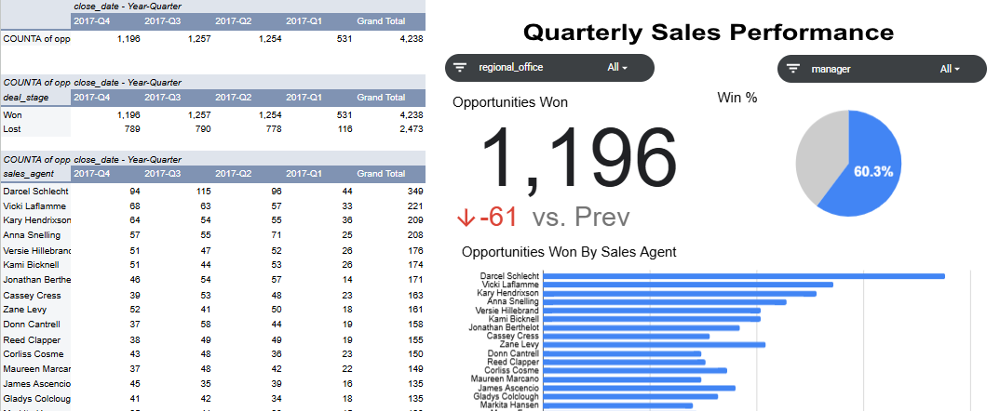

# CRM Sales Dashboard

---
## Project Overview
This project presents a dynamic CRM Sales Dashboard built using Google Sheets. It offers an overview of opportunity outcomes and sales agent performance across different quarters.
The focus is on leveraging pivot tables and charting tools to transform raw sales data into meaningful, easy-to-understand visuals.

---

## Objectives
- To organize and analyze sales pipeline data
- To build a flexible dashboard using pivot tables and charts
- To explore trends over time in sales outcomes
- To visualize quarterly performance at both team and individual levels

---

## Files
- [Google Sheet – Sales Dashboard](https://docs.google.com/spreadsheets/d/16IZP4XY1Nv4s2Aw7dyR25pG8gmtOnWhae7PulhHktDU/edit?usp=sharing)
    - Dashboard visuals and pivot tables are located in the Pivot Table 2 sheet.

---

## Dashboard Features
1. Pivot Tables:
    - Opportunities won by quarter
    - Percentage breakdown of won vs. lost deals
    - Sales agent performance over time
2. Scorecard Chart:
    - Shows change in opportunities won from one quarter to the next
    - Uses visual indicators for quick interpretation
3. Organized Layout:
    - Data is structured for readability and ease of update
Visuals help stakeholders identify patterns at a glance

---

## Tools & Functions Used
1. Google Sheets
2. Pivot Tables & Charts
4. Scorecard Chart
3. Functions: XLOOKUP, COUNTA, and basic date grouping

---

## Example Use Cases:Quickly evaluate quarterly performance trends
- Visualize team contribution to overall pipeline success
- Present clean summaries to stakeholders or leadership

---

## Created by:Rosemary Ojwang
Aspiring Data Analyst | Google Data Analytics Certified | ALX Data Science Learner

